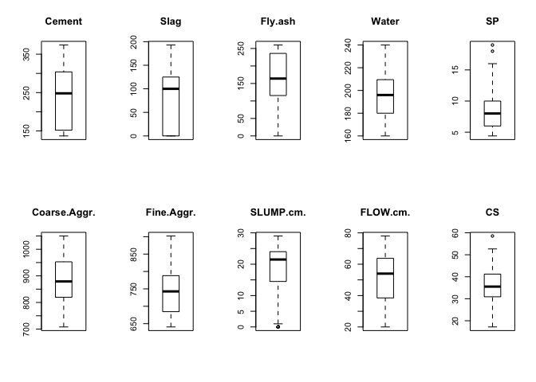
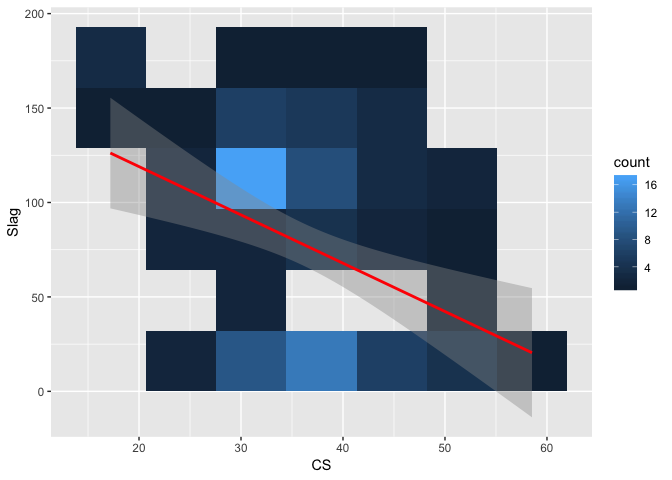
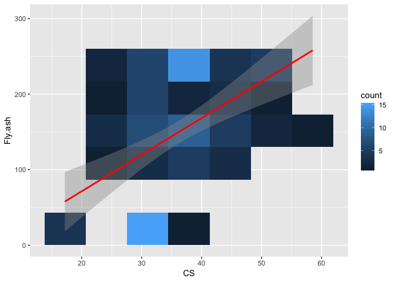
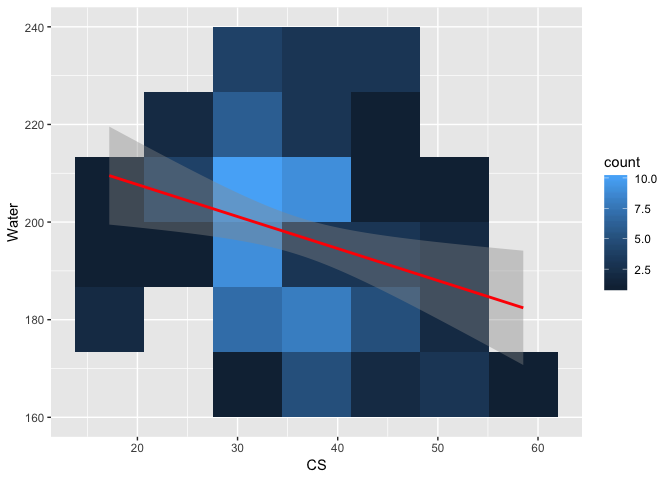
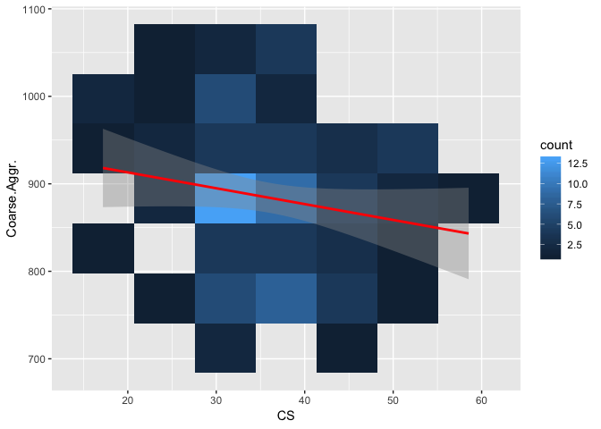
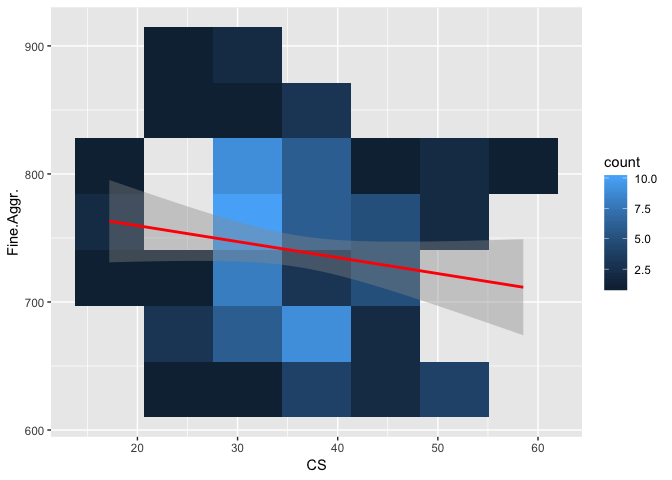
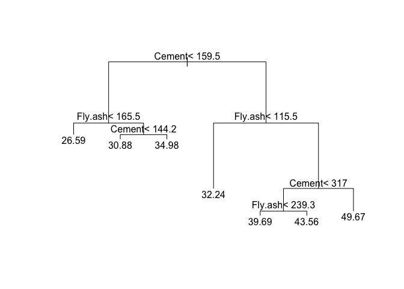
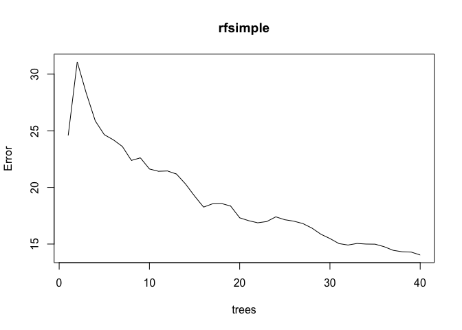

NYC DOE Data Science Task
================

``` r
#Read in the data from the website
dat <- 
  read.csv("https://archive.ics.uci.edu/ml/machine-learning-databases/concrete/slump/slump_test.data")
colnames(dat) <- c(colnames(dat)[1:10], "CS")
```

Section 1 - EDA
===============

The Process
-----------

I first observed from looking at the data description that all of the variables are quantitative, so I will only utilize visualizations which help to understand the nature of quantitative variables. Of particular interest is the variable "Compressive Strength" (CS) as this is the variable which the rest of the analysis will be modelled around. When performing an EDA I like to look for the structure of the variables individually and how they interact. In this section I will only look at the individual structures and then explore the interactions in the next section as I investigate correlation.

Visualizations
--------------

I first create a boxplot of all of the 10 variables below.

``` r
par(mfrow=c(2,5))

for (i in 2:11) {
  boxplot(dat[,i], main=colnames(dat[i]))
}
```



From the above figures one can get an idea of where the data points lie. If one focuses their attention on CS (the last figure at the bottom right) it can be observed that since the thick black line appears to be at about 35, that the half the data points of this variable lie above 35 and half lie below 35. Further since the two dotted lines end at roughly 19 and 52, respectively, that almost all of the data sits between these two values. Of course translating this idea to each of the other variables one can observe similar traits. One might find it interesting to see that the range of data points for each of the variables varies quite a lot and the numbers can get quite big (for example in the case of Coarse.Aggr.)

After looking at the centers of distribution above I thought it would be useful to observe the full distributions of each of the variables, as seen below.

``` r
par(mfrow=c(2,5))

for (i in 2:11) {
  plot(density(dat[,i]), main=colnames(dat[i]), xlab="")
}
```


The above density plots display the distribution of the data. For instance, for the variable CS (again in the bottom right corner) one can observe that most data points lie close to 35, since that is the peak of the graph. This is interesting because the previous figure illuminated the fact that 35 is the center of the distribution. In many of the other variables such as Cement, Slag, Fly.ash, SLIUMP.cm., and FLOW.cm.; one can see that there is more than one peak. This indicates that the data points do not necessarily act nicely and in some statistical models this can be troublesome.

Influence of EDA on Additional Analyses
---------------------------------------

From visualizing the data it was observed that CS has a nice structure but some of the other variables do not. This could limit some statistical tests, but based on the further questions it should not be too limiting to the ends of this assessment.

Section 2 - Correlation
=======================

Next I will create visualizations of the correlation between CS and each of the seven input variables.

Explanation of Figure - Cement
------------------------------

``` r
library(ggplot2)
cor1 <- ggplot(dat,aes(x=CS,y=Cement)) + geom_bin2d(bins=6) + geom_smooth(method='lm', col="red")
cor1
```


Above is a visual representation of the correlation between the variables CS and Cement. Since many of the blue blocks sit somewhat close to the red line, this indicates that there is some correlation between CS and Cement. In particular the figure suggests that as one variable increases, the other increases as well. In other words one can think of these two variables as "holding hands" or rather holding pinkies since the blue blocks are not *very* close to the red line, but they are nearby to one another nonetheless. In this illustration if one were to walk in one direction then since they are holding hands the other must go in that direction as well.

### Slag

``` r
cor2 <- ggplot(dat,aes(x=CS,y=Slag)) + geom_bin2d(bins=6)+geom_smooth(method='lm', col="red")
cor2
```



### Fly.ash

``` r
cor3 <- ggplot(dat,aes(x=CS,y=Fly.ash)) + geom_bin2d(bins=6)+geom_smooth(method='lm', col="red")
cor3
```



### Water

``` r
cor4 <- ggplot(dat,aes(x=CS,y=Water)) + geom_bin2d(bins=6)+geom_smooth(method='lm', col="red")
cor4
```



### SP

``` r
cor5 <- ggplot(dat,aes(x=CS,y=SP)) + geom_bin2d(bins=6)+geom_smooth(method='lm', col="red")
cor5
```


### Coarse.Aggr.

``` r
cor6 <- ggplot(dat,aes(x=CS,y=Coarse.Aggr.)) + geom_bin2d(bins=6)+geom_smooth(method='lm', col="red")
cor6
```



### Fine.Aggr.

``` r
cor7 <- ggplot(dat,aes(x=CS,y=Fine.Aggr.)) + geom_bin2d(bins=6)+geom_smooth(method='lm', col="red")
cor7
```



Correlation Summary
-------------------

The above figures indicate that the variables Cement and Fly.ash are most predictive of CS. To further verify this I can calculate the correlation coefficients in relation to CS.

``` r
cor(dat[2:8], dat[11])
```

    ##                       CS
    ## Cement        0.44572481
    ## Slag         -0.33158802
    ## Fly.ash       0.44439260
    ## Water        -0.25423498
    ## SP           -0.03787084
    ## Coarse.Aggr. -0.16068394
    ## Fine.Aggr.   -0.15448431

From the above output it can readily be seen that Cement and Fly.ash have the highest correlation with CS and in a linear based model will be the most effective predictors.

Section 3 - Decision Trees
==========================

Next I create a single decision tree to predict CS using Cement and Fly.ash. I first partition the data into training and testing data so that we can test the accuracy of the model.

``` r
#split into training and testing data
smp_size <- floor(0.8*nrow(dat))

## set the seed to make the partition reproducible
set.seed(123)
train_ind <- sample(seq_len(nrow(dat)), size = smp_size)

train <- dat[train_ind, ]
test <- dat[-train_ind, ]
```

``` r
library(rpart)

#create the decision tree
dtree <- rpart(CS ~ Cement + Fly.ash, data=train, method="anova")

#create the visualization of the tree
plot(dtree,margin=0.05)
text(dtree)
```



Visualization Explanation
-------------------------

The above decision tree figure is a way to stratify all of the data points. At each step there is a criteria and if it is met then one goes to the next criteria to the right, otherwise one goes to the next criteria on the left. Each step was chosen so that the largest amount of data falls into the right position. One can think of this like ordering in a restaurant. One is first asked what one would like to eat, then based on that answer they are asked what sauce they would prefer, then based on that answer they are asked what side dishes they would prefer, and so forth until the order is complete.

Test Error Signification
------------------------

I calculate the root mean square error (RMSE) on the holdout data.

``` r
#test set RMSE

sqrt(sum((predict(dtree, test, type="vector")-test$CS)^2)/(21-3))
```

    ## [1] 5.96282

A RSME of 5.96 is quite good. This indicates that when the decision tree is provided with new data, the overall distance from the true values for each of the points is not very far.

Ideal Depth
-----------

The ideal depth of this tree model is four steps. R can automatically calculate what the ideal depth should be, which would minimize the RMSE. There are other factors to take into account such as overfitting the data, but due to time constraints I do not delve too deeply into testing for this.

Accuracy Score
--------------

Since this model has a continuous response variable I cannot calculate accuracy per se but instead can only speak of error, which was handled above. If this were a discrete model then I could calculate the correct amount of predictions over the total predictions, but in this model it is very rare that it predicts exactly the correct value.

Section 4 - Random Forest
=========================

Next I create a random forest to predict CS. First I will include all of the input variables and then I will evaluate the importance of each of the variables to simplify the model so that I can avoid overfitting the data.

``` r
library(randomForest)
```

    ## randomForest 4.6-14

    ## Type rfNews() to see new features/changes/bug fixes.

    ## 
    ## Attaching package: 'randomForest'

    ## The following object is masked from 'package:ggplot2':
    ## 
    ##     margin

``` r
#create a random forest
rf <- randomForest(CS ~ Cement+Slag+Fly.ash+Water+SP+Coarse.Aggr.+Fine.Aggr., data=train, type="anova")

#determine importance scores. 
importance(rf)
```

    ##              IncNodePurity
    ## Cement           1121.4055
    ## Slag              555.0250
    ## Fly.ash           849.6232
    ## Water             635.7366
    ## SP                278.8938
    ## Coarse.Aggr.      374.7220
    ## Fine.Aggr.        392.9587

The above output suggests that Cement is the most important while Fly.ash, Water, and Slag are also fairly important. I'll now simplify the model to include only these variables.

``` r
#simpler model
rfsimple <- randomForest(CS~ Cement+Slag+Fly.ash+Water, data=train, type="anova", ntree=40,mtry=4)

#plot of error decreasing as the amount of trees increase
plot(rfsimple)
```



The above plot shows how the error decreases as the amount of trees in the random forest decreases. The RMSE on the testing data is calculated below to be 4.77, which is lower than the RMSE for just a single decision tree so this is certainly an improvement on that model.

``` r
sqrt(sum((predict(rfsimple, test, type="response")-test$CS)^2)/(21-5))
```

    ## [1] 5.03912

Amount of Trees
---------------

This model contains 40 trees. I did not want to set the amount of trees to be too high because then I could overfit the data. I first fit the model with 500 trees and looked at the above plot and observed that around 40 the decreasing error line seemed to level out. I then concluded that 40 is the cutoff where the model only becomes marginally stronger per more trees added.

Amount of Features
------------------

My model accounts for four features. I found above that only four of the features had an importance score above 500, so I decided to only include those four in the model. Again I wanted to avoid putting too many features in the model because that would run the risk of overfitting the data and then creating a model which performs poorly on new data.

Section 5 - Additional Remarks
==============================

Alternative Methods
-------------------

Given more time I would consider building a neural network to predict CS. These models are incredibly powerful and more likely to uncover hidden information about the data that a linear model would not.

Additional Data
---------------

Some additional data that might be useful in predicting CS would be environmental data such as temperature, humidity, and barometric pressure when these other measurements were taken. It is possible that these extra factors could affect the quality of the concrete.

Additional Analyses based on EDA
--------------------------------

Based on the EDA in section 1 I observed that the distribution of many of the predictor variables were multimodal. It might improve the results of a linear model if I were to treat the two (or three, etc.) modes as factors and constructed the model accordingly. This could simplify computations and also improve the accuracy by eliminating the confusion when data points fall between the two modes.

Applications of proposed models
-------------------------------

The above analysis could be applied in an enormous amount of situations; in particular it can be applied to cities around the world where concrete is used. It is well known that America's infrastructure is overdue for massive updates, and much of that has to do with the structural integrity of concrete. The above models can be used to determine what factors in concrete are useful in durability of the substance. If we have a good model for the lifeline of concrete then we can better approximate what infrastructure needs improvement and when.
